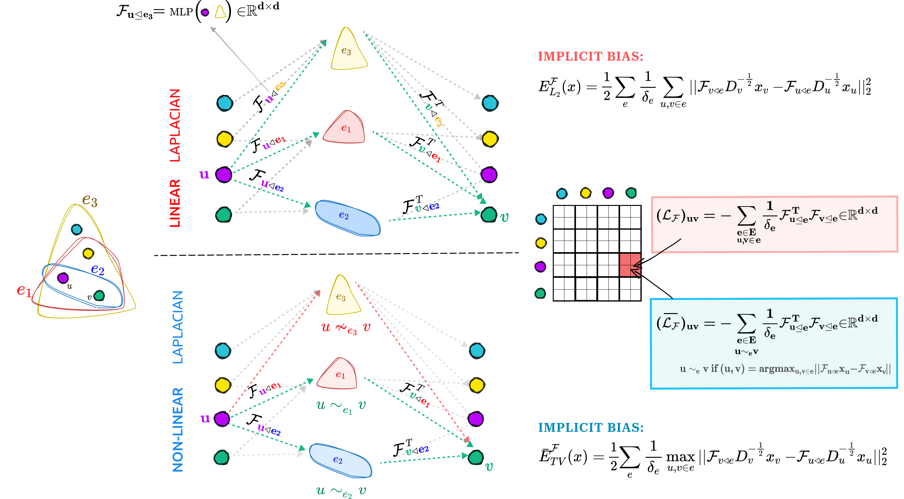

# Sheaf Hypergraph Networks

This is the official code for SheafHNN/SheafHGCN models as introduced in [Sheaf Hypergraph Networks](https://arxiv.org/abs/2309.17116)

<div align="center">
  
</div>

## Citation
Please use the following BibTeX to cite our work.
```
@inproceedings{NEURIPS2023_27f243af,
 author = {Duta, Iulia and Cassar\`{a}, Giulia and Silvestri, Fabrizio and Li\'{o}, Pietro},
 booktitle = {Advances in Neural Information Processing Systems},
 editor = {A. Oh and T. Neumann and A. Globerson and K. Saenko and M. Hardt and S. Levine},
 pages = {12087--12099},
 publisher = {Curran Associates, Inc.},
 title = {Sheaf Hypergraph Networks},
 url = {https://proceedings.neurips.cc/paper_files/paper/2023/file/27f243af2887d7f248f518d9b967a882-Paper-Conference.pdf},
 volume = {36},
 year = {2023}
}
```

Note: The general pipeline used in this repo is based on the public repository of https://github.com/jianhao2016/AllSet and https://github.com/Graph-COM/ED-HNN. In generating the sheaves, we also use some utilitary functions from https://github.com/twitter-research/neural-sheaf-diffusion. 

We would like to thank all the authors of the above papers for their work and for making the code available. 


## Enviroment requirement:
The required env is stored in: sheaf_hnn_env.yml

## Overview:

`models.SheafHyperGNN(args, sheaf_type)` -- contains code for SheafHyperGNN (HGNN with Linear Sheaf Hypergraph Diffusions)

`models.SheafHyperGCN(V, num_features, num_layers, num_classses, args, sheaf_type)` -- contains code for SheafHyperGCN (HGCN with Non-Linear Sheaf Hypergraph Diffusions)  

`sheaf_builder.SheafBuilderDiag(args)`, `sheaf_builder.SheafBuilderOrtho(args)`, `sheaf_builder.SheafBuilderGeneral(args)` -- generate the sheaf reduction map (\in nd x nd) Diag/General or Ortho  used for the linear model

`sheaf_builder.HGCNSheafBuilderDiag(args)`, `sheaf_builder.HGCNSheafBuilderOrtho(args)`, `sheaf_builder.HGCNSheafBuilderGeneral(args)` -- generate the sheaf reduction map (\in nd x nd) Diag/General or Ortho used for the non-linear model

`sheaf_builder.predict_blocks_*()` -- the model predicting d, d*(d-1)//2 or d^2 parameters used to build the reduction map. The models different in the way the hyperedge features are created from node features: mlp_var1 or mlp_var2 or  mlp_var3 or cp_decomp

`layers.HypergraphDiagSheafConv(...)`, `layers.HypergraphGeneralSheafConv(...)`, `layers.HypergraphOrthoSheafConv(...)` -- convolutional propagation for (linear) sheaf model. Mainly same as the traditional one, with the normalisation slightly changed

`hgcn_sheaf_laplacians.SheafLaplacian*` -- builds sheaf laplacians corresponding to the amin-amax graph extracted from the hyeprgraph (with mediators)

`hgcn_sheaf_laplacians.SheafLaplacianDiag`, `hgcn_sheaf_laplacians.SheafLaplacianGeneral`, `hgcn_sheaf_laplacians.SheafLaplacianOrtho` -- generate the non-linear sheaf Laplacian(s)

## How to run the model

A concrete example of using the sheaf model can be seen in `tutorial.py`.

E.g. To create a SheafHyperGNN (Linear) model with diagonal sheaf run:

```
model = SheafHyperGNN(args, 'SheafHyperGNNDiag')
```

E.g. To create a SheafHyperGCN (Non-Linear) model with diagonal sheaf run:
```
model = SheafHyperGCN(num_nodes, num_features, num_layers, num_classses
                         args, 'DiagSheafs')
                         
```


## Prepare Datasets
To generate datasets please follow the instructions from https://github.com/jianhao2016/AllSet and place the data folder in `../data`

## Example of script to run one experiment on Citeseer

For SheafHyperGNN:
```
CUDA_VISIBLE_DEVICES=0 python train.py --AllSet_input_norm=True --All_num_layers=2 --MLP_hidden=256 --dname=citeseer --dropout=0.7 --epochs=100 --heads=6 --init_hedge=avg --lr=0.001 --method=SheafHyperGNNDiag --runs=10 --sheaf_act=tanh  --sheaf_normtype=sym_degree_norm --sheaf_pred_block=cp_decomp --wd=1e-05
```

For SheafHyperGCN:
```
CUDA_VISIBLE_DEVICES=0 python train.py --AllSet_input_norm=True --All_num_layers=2 --MLP_hidden=256 --dname=citeseer --dropout=0.7 --epochs=100 --heads=6 --init_hedge=avg --lr=0.001 --method=SheafHyperGCNDiag --runs=10 --sheaf_act=tanh  --sheaf_normtype=sym_degree_norm --sheaf_pred_block=cp_decomp --wd=1e-05
```


